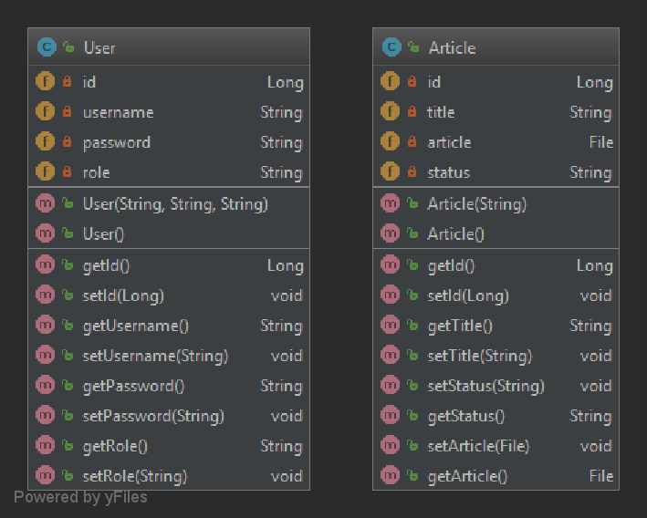

# Article Submission and Review System

## Group: test group please ignore

### Members

- Conor McKeen (101008993)
- Alden Wang (101027686)

### Build Status
Platform: http://article-submission-and-review.herokuapp.com  

### Project Prompt

This web-app will host articles that can be reviewed and edited. Submitted articles can be searchable or sorted/filtered. Articles are assigned due dates which can be highlighted/filtered. Changes to articles will be recorded.

Article statuses: Submitted, in review, accepted, rejected

Roles: Article submitter - Submits articles as an attachment in any format. Can view reviews on their articles. Editors - Assigns articles to reviewer with a deadline to submit the review. Can accept/reject article based on review.
Reviewers - Submits reviews of articles. Can view a list of articles assigned to them.

Articles are viewable to: Article submitter, editor, assigned reviewers. Reviews are viewable to: Article submitter, editors

### Features

### Project Status 05-03-2019

- Project hosted on Travis CI, build successful
- Application runs on Heroku
- Initial commits have been made (Frameworks, Maven project)
- UML class digrams have been created (MVC, Database schema)

### Project Status 05-20-2019

- Unit tests are in place for users and article repositories
- Database containing users and articles have been initialised
- Added fileupload?

### TODO

- Create user roles, add permissions
- Secure logins
- Add files as a field to article objects so they can be properly stored in the db
- Manage file permissions for each role to be listed, edited, deleted

